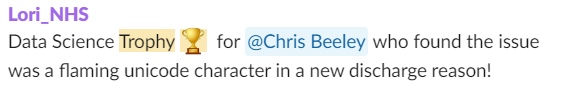
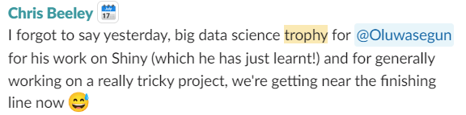
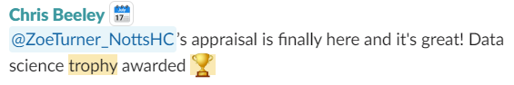

Alongside the trust tools such as email and MS Teams the team uses the NHS-R slack for communication thing. We have our own channel (private). This can be used for general work enquires but is also used much more casually. It is an acceptable way to communicate things like sickness of last-minute absence. We do have a team email which we have for things like arranging [UYD meetings]().

## Data Science Trophy

One of the ways we celebrate each other and the successes we have is by presenting each other with a “trophy” in the slack channel. This is for good code, problem solving, anything that deserves a special mention.

## Birthdays

We don’t buy gifts for each other within the team, but we do like a good excuse for a celebration and a get together. Which brought in a tradition referred to as the “birthday challenge”. This is where the team presents you with a task. This task does commonly revolve around an area which you may need to practise and develop skills in. Although may be done in such a way to cause minor irritation. However, it all ends with an e-card, a personalized slack emoji, and a lot of cheers.

## Christmas

For Christmas we do like to have a get together virtually, traditionally will involve some kind of silly dress code and be a time to get together. There will often be a quiz or other type of game.